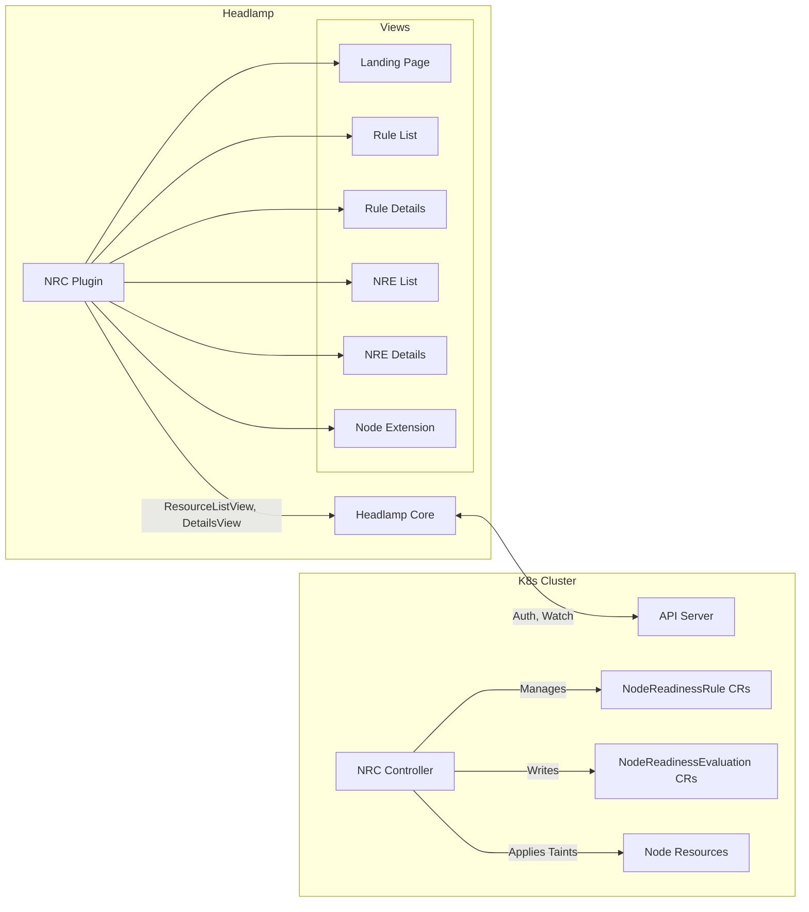

# UI Design Document: Node Readiness Controller

### LFX Project: Headlamp Plugin for Node Readiness Controller (Term 3)

This project brings native UI visibility to the Node Readiness Controller (NRC) via a [Headlamp](https://headlamp.dev/) plugin. This is a continuation of the Term 2 observability project, which delivered the metrics foundation, scrape-time collectors, and Grafana dashboard.

The project answers two main questions:

1. **Per-object readiness state:** Why is this specific node not accepting workloads? Which rule, condition, or taint is holding it back? Today this requires `kubectl describe node`, controller logs, or raw YAML parsing.
2. **Fleet-wide rule enforcement:** Across all rules, how many nodes are matched, held, or released? Which rules are failing and where? Today this is answered only through Prometheus queries and the Grafana dashboard built in Term 2.

## Goals

* Build a Headlamp plugin to visualize cluster-wide rule enforcement and per-node readiness state.
* Provide cluster-level views: all `NodeReadinessRule` objects with nodes matched / held / bootstrap-completed per rule.
* Provide node-level detail views: which rules apply to a node, per-condition status with failure reasons, and NRC-managed taints.
* Build a unified lifecycle-conditions panel showing NRC custom conditions alongside standard kubelet conditions.
* Serve as the first consumer ("soaking test") of the upcoming [`NodeReadinessEvaluation`](https://github.com/kubernetes-sigs/node-readiness-controller/issues/327) CRD, reporting bugs and design gaps back to the NRC controller team.
* Minimize Kubernetes API overhead. Watch-based, API-state only.
* Validate and document UX and scale tests / limits for the plugin.
* Publish to Headlamp Artifact Hub with documentation.

## Non-Goals

* Build a standalone backend API or web server. The plugin runs entirely inside Headlamp.
* Replace the Prometheus metrics and Grafana dashboard from Term 2. Headlamp gives visibility into per-object questions; Grafana answers fleet-wide SLO questions over time.
* Implement custom WebSocket or polling mechanisms. We rely on Headlamp's built-in watch hooks.

## Relationship to Term 2 Observability

The Term 2 observability project delivered Prometheus metrics (`node_readiness_rule_nodes{state}`, `node_readiness_rule_matched_nodes`, etc.) via scrape-time collectors and a Grafana dashboard for fleet-wide SLO monitoring. This plugin complements that work by answering **per-object** questions that metrics cannot: _which_ node is failing _which_ rule's _which_ condition, and what the failure reason is. The two systems serve different personas — Grafana for SREs monitoring trends over time, Headlamp for operators debugging a specific node right now.

---

## Design

### 1. Personas

We design the UI around the same distinct personas used in the controller observability design.

1. **Infrastructure Owners (Cluster Operators):** They run the cluster and manage the node lifecycle. They need a Landing Page to confirm the controller is active and see fleet-wide enforcement status without leaving the dashboard. This is presented via high-level summary cards (e.g., Total Active Rules, Targeted Nodes, Satisfied Nodes, Failed Nodes) without requiring heavy per-node data fetching (see Section 7.1).
2. **Component / Rule Owners:** They own the infrastructure components that gate node readiness (CNI, GPU drivers, CSI). They need the Rule Details View to see how their rule propagates. *(Note: To identify specific failing nodes, the plugin will rely exclusively on the new `NodeReadinessEvaluation` (NRE) objects, bypassing legacy fields entirely. We plan to explore optimal ways to list failing NREs per rule—such as via NRE label selectors—without fetching all NREs globally.)*
3. **Workload Owners (Application Developers):** They run pods. They need the Node Detail Extension and the `NodeReadinessEvaluation` (NRE) Details View to understand exactly which conditions or rules are preventing their pods from scheduling on a specific node.

---

### 2. Code Organization

The project spans two repositories. All plugin UI code (React components, styles, tests) lives in the [Headlamp plugins repository](https://github.com/headlamp-k8s/plugins/tree/main/node-readiness-controller). Design documentation and any backend API changes live in the [NRC repository](https://github.com/kubernetes-sigs/node-readiness-controller).

| Repository | Contents |
|---|---|
| `headlamp-k8s/plugins/node-readiness-controller` | Plugin source (`src/`), `package.json`, unit tests, `CODEOWNERS`, Artifact Hub metadata. Reviewed by Headlamp and NRC maintainers. |
| `kubernetes-sigs/node-readiness-controller` | This design document (`docs/`), backend changes (e.g., `status.nodeEvaluations` on `NodeReadinessRule`). Reviewed by NRC maintainers. |

All PRs are cross-referenced against [Issue #327](https://github.com/kubernetes-sigs/node-readiness-controller/issues/327) for traceability.

---

### 3. CRD Data Surface

The plugin reads from the `readiness.node.x-k8s.io/v1alpha1` API group. Both custom resources are cluster-scoped.

#### 3.1 NodeReadinessRule Fields Consumed

| JSON Path | Type | Used In |
|---|---|---|
| `metadata.name` | `string` | Rule List, Rule Details |
| `metadata.creationTimestamp` | `Time` | Rule List (Age column), Rule Details |
| `metadata.deletionTimestamp` | `Time` | Rule List (Terminating status indicator) |
| `spec.enforcementMode` | `"bootstrap-only"` or `"continuous"` | Rule List (chip), Rule Details |
| `spec.dryRun` | `bool` | Rule List (warning chip), Rule Details |
| `spec.nodeSelector.matchLabels` | `map[string]string` | Rule List, Rule Details |
| `spec.nodeSelector.matchExpressions` | `[]LabelSelectorRequirement` | Rule List, Rule Details |
| `spec.conditionPolicy` | `"allOf"` or `"anyOf"` | Rule List (chip), Rule Details |
| `spec.taint.key` | `string` | Rule List, Rule Details |
| `spec.taint.value` | `string` (optional) | Rule List, Rule Details |
| `spec.taint.effect` | `"NoSchedule"` / `"PreferNoSchedule"` / `"NoExecute"` | Rule List (chip), Rule Details |
| `spec.conditions[].type` | `string` | Rule Details (Conditions Table) |
| `spec.conditions[].requiredStatus` | `"True"` / `"False"` / `"Unknown"` | Rule Details (Conditions Table) |
| `spec.conditions[].defaultStatus` | `"True"` / `"False"` / `"Unknown"` | Rule Details (Conditions Table) |
| `status.dryRunResults.affectedNodes` | `*int32` | Rule Details (Dry-Run section) |
| `status.dryRunResults.taintsToAdd` | `*int32` | Rule Details (Dry-Run section) |
| `status.dryRunResults.taintsToRemove` | `*int32` | Rule Details (Dry-Run section) |
| `status.dryRunResults.riskyOperations` | `*int32` | Rule Details (Dry-Run section) |
| `status.dryRunResults.summary` | `string` | Rule Details (Dry-Run section) |

> **Dependency Note:** The plugin computes aggregated statistics (targeted, satisfied, failed nodes) entirely client-side by iterating over the existing `status.nodeEvaluations` array. This provides immediate, real-time observability without introducing backend overhead or new API fields. Once the upcoming `NodeReadinessEvaluation` (NRE) CRD stabilizes, the plugin will transition to consuming those resources.\n\n#### 3.2 NodeReadinessEvaluation Fields Consumed

The `NodeReadinessEvaluation` (NRE) CRD is a per-node evaluation object currently under development ([Issue #327](https://github.com/kubernetes-sigs/node-readiness-controller/issues/327)). It is targeted to ship as **experimental in NRC v0.6.0** and stabilize in **v0.7.0**.

The Headlamp plugin will serve as the first consumer of NRE, acting as a soaking test to validate the API design and uncover bugs before NRE graduates to stable. The NRE views (Sections 7.4 and 7.5) will be implemented once NRE merges.

The following table lists the *expected* NRE fields based on the current design proposal. These will be finalized once the NRE CRD is merged upstream.

| JSON Path (Expected) | Type | Used In |
|---|---|---|
| `metadata.name` | `string` (matches target node name) | NRE List, NRE Details |
| `metadata.creationTimestamp` | `Time` | NRE List (Age column) |
| `status.state` | `"Available"` / `"NotAvailable"` | NRE List (State column), NRE Details |
| `status.taints[]` | `[]Taint` | NRE Details (Active Taints) |
| `status.rules[].ruleName` | `string` | NRE Details (Rule Evaluations table) |
| `status.rules[].ruleStatus` | `"Satisfied"` / `"Unsatisfied"` | NRE Details (Rule Evaluations table) |
| `status.rules[].reason` | `string` | NRE Details (expanded row) |
| `status.rules[].message` | `string` | NRE Details (expanded row) |
| `status.rules[].lastEvaluationTime` | `Time` | NRE Details (expanded row) |

> **Caveat:** These field paths are preliminary. When NRE merges, the actual API surface may differ. The plugin's NRE views will be updated to match the final schema.

#### 3.3 Kubernetes Node Object Fields Consumed

| JSON Path | Used For |
|---|---|
| `spec.taints[]` | Filtering taints with `readiness.k8s.io/` prefix |
| `status.conditions[]` | Grouping NRC custom conditions vs standard kubelet conditions |
| `spec.unschedulable` | Cross-referencing with NRC taint state |

---

### 4. Integration Architecture

The plugin is a standard Headlamp extension built with React and TypeScript (`@kinvolk/headlamp-plugin`). It uses Headlamp's built-in Kubernetes API client for authentication and RBAC. No standalone backend.

#### Required RBAC Permissions

The plugin requires the following minimum ClusterRole permissions for full functionality:

| API Group | Resource | Verbs | Used By |
|---|---|---|---|
| `readiness.node.x-k8s.io` | `nodereadinessrules` | `get`, `list`, `watch` | Rule List, Rule Details, Landing Page |
| `readiness.node.x-k8s.io` | `nodereadinessevaluations` | `get`, `list`, `watch` | NRE List, NRE Details, Node Extension |
| `""` (core) | `nodes` | `get`, `list`, `watch` | Node Extension |

> If the user lacks NRE permissions, the NRE views and Node Extension are silently omitted (see Section 7.6). If the user lacks NRR permissions, the plugin shows Headlamp's native permission error.

---

### 5. State Synchronization

The UI must stay in sync with cluster state. When an operator modifies, creates, or deletes a rule via `kubectl`, the UI must update without page reloads.

**Decision:** No custom polling or WebSockets. The plugin relies directly on Headlamp's high-level native components (`ResourceListView` and `DetailsView`), which internally manage data fetching and watch subscriptions. These components leverage the Kubernetes Watch API under the hood and automatically trigger React re-renders on standard watch events:

* **`ADDED`:** New row appears in the list view automatically.
* **`MODIFIED`:** Changed fields (status counts, spec edits) re-render in place.
* **`DELETED`:** Item is removed from list. If viewing the Details page of a deleted resource, the component returns a `404` and the UI renders a "Resource not found" fallback.

No manual DOM manipulation is needed. React's reconciliation handles all UI updates from the internal component state changes.

---

### 6. Data Fetching Strategy

#### Decisions

| Decision | Rationale |
|---|---|
| **Lazy initial load.** The Landing Page verifies CRD existence only. It does not list rules or evaluations until the user navigates deeper. | Prevents API blast on plugin open. |
| **Client-side aggregation.** Node counts (targeted, satisfied, failed) are computed dynamically in the browser by aggregating `status.nodeEvaluations`. | Iterating over an array of 5,000 evaluations takes < 1ms in modern JavaScript, providing immediate UI value without expensive backend API changes. |\n| **Cardinality-aware filtering.** Columns like Name, Node Selector, and Taint are filterable but high-cardinality. Filters will use exact-match or substring search, not dropdown enums. Low-cardinality columns (Mode, Effect, Dry-Run) use dropdown filters. | Prevents loading thousands of unique filter values into memory. |

---

### 7. UI Surface

We define six primary user interfaces plus supporting features. All views use Headlamp's native `StatusLabel` component with colored badges for status indicators — **not emojis** — to stay consistent with the Headlamp community's established visual style. All interactive components use standard `@mui/material` components (`Chip`, `Typography`, `Box`, `Tooltip`, `Card`) to match Headlamp's visual aesthetic.

#### 7.1 Landing Page

The entry point for the plugin. Does not fetch heavy data.

* **CRD Detection:** On mount, performs a lightweight API discovery call to check for the `NodeReadinessRule` CRD. If not installed, shows a Headlamp `<EmptyContent>` component with the message: `"Node Readiness Controller CRDs not installed"`, alongside a standard Headlamp `<Link>` pointing to the [NRC installation documentation](https://node-readiness-controller.sigs.k8s.io/getting-started/).
* **CRD Status:** A Headlamp `<StatusLabel>` with `status="success"` showing `"CRD Installed"` or `status="error"` showing `"CRD Not Found"`.
* **Controller Health Limitation:** CRD presence confirms the API schema is registered but does **not** guarantee the controller manager pods are healthy or actively reconciling. Detecting controller liveness would require either checking controller Deployment/Pod status (which requires additional RBAC) or querying Prometheus metrics (which Headlamp does not natively support). For the initial release, we accept this limitation and document it. Future iterations may add a controller health check if a reliable, low-overhead mechanism is identified.
* **Infographics:** Four Material UI `<Card>` components in a flex row, each showing a single metric:
  * **Active Rules:** Count of `NodeReadinessRule` objects (from the list response `.items.length`).
  * **Targeted Nodes:** Sum of `nodeEvaluations.length` across all rules.
  * **Satisfied Nodes:** Sum of evaluations where `taintStatus === 'Absent'` across all rules.
  * **Unsatisfied Nodes:** Sum of evaluations where `taintStatus === 'Present'` across all rules.
  * **Failed Nodes:** Sum of `failedNodes.length` across all rules.
  * *Design Risk:* Targeted/Satisfied/Failed sums may double-count unique nodes if a node is targeted by multiple rules. For accurate deduplicated counts, future iterations may integrate with Headlamp's Prometheus metrics configuration or consume a cluster-level summary API.

#### 7.2 Rule List View

Table of all `NodeReadinessRule` objects, utilizing Headlamp's native `ResourceListView`.

**Error States:**
* If the CRD is missing (API returns `404`), renders a Headlamp `<EmptyContent>` component with the message `"Node Readiness Controller CRDs not installed"` and a `<Link>` to the [installation guide](https://node-readiness-controller.sigs.k8s.io/getting-started/).
* If RBAC denies access (API returns `403`), renders Headlamp's native permission error view.

| Column | Source | Filterable | Exact Component & Style |
|---|---|---|---|
| Name | `metadata.name` | Yes (substring) | Standard Headlamp `<Link>` to the Rule Details page. If `spec.dryRun: true`, a Material UI `<Chip color="warning" size="small" label="Dry Run" />` is rendered beneath the link. |
| Enforcement | `spec.enforcementMode` & `spec.conditionPolicy` | Yes (dropdowns) | Two stacked Material UI `<Chip variant="outlined" size="small" />` elements. Example: `Mode: continuous`, `Policy: allOf`. |
| Status | Computed from `nodeEvaluations` | Yes (dropdown: all satisfied / not all satisfied) | Headlamp `<StatusLabel>`. Uses `status="success"` with text `"OK ({satisfiedNodes}/{targetedNodes})"` when all targeted nodes are satisfied. Uses `status="warning"` with text `"Pending ({satisfiedNodes}/{targetedNodes})"` otherwise. If `status.nodeEvaluations` is absent (pending first evaluation), shows `"Pending"`. |
| Unsatisfied Nodes | Count where `taintStatus === 'Present'` | Yes (dropdown: has unsatisfied / none) | Simple `<Typography>` text displaying the integer count if > 0. If 0, renders a literal `"-"`. |
| Failed Nodes | `failedNodes.length` | Yes (dropdown: has failures / none) | Simple `<Typography>` text displaying the integer count if > 0. If 0, renders a literal `"-"`. |
| Node Selector | `spec.nodeSelector` | No (due to `matchExpressions` complexity) | A flex row of `<Chip size="small" />` summaries. For `matchLabels`: `"{count} Labels"`. For `matchExpressions`: `"{count} Expressions"`. Wrapped in a Material UI `<Tooltip>` that reveals the full JSON on hover. |
| Taint | `spec.taint` | Yes (substring) | Material UI `<Chip variant="outlined" size="small" />`. Text format: `{key}={value}:{effect}` when `spec.taint.value` is set, or `{key}:{effect}` when value is empty. |
| Age | `metadata.creationTimestamp` | No | Simple `<Typography>` text rendered via Headlamp's native `age` time formatter function (e.g., `"2d 5h"`). |

#### 7.3 Rule Details View

Deep dive into a single `NodeReadinessRule`, utilizing Headlamp's `DetailsView`.

**Error States:**
* If navigating to a deleted rule (API returns `404`), renders Headlamp's native `<EmptyContent>` with text `"Resource not found"`.
* If RBAC denies access (API returns `403`), renders a custom `<EmptyContent>` explaining the lack of read permissions for `nodereadinessrules`.

**Basic Info Section:**
Rendered using Headlamp's native `<Resource.MainInfoSection>` header component.

| Field | Source | Exact Component & Style |
|---|---|---|
| Name | `metadata.name` | Headlamp's native header. |
| Creation Timestamp | `metadata.creationTimestamp` | Headlamp's native header. |
| Labels | `metadata.labels` | Headlamp's native header. |
| Node Selector | `spec.nodeSelector` | Flex container of Material UI `<Chip>` components. For `matchLabels`: one `<Chip>` per key/value pair formatted as `key=value`. For `matchExpressions`: one `<Chip>` per expression formatted as `key operator [values]`. |
| Enforcement Mode | `spec.enforcementMode` | Material UI `<Chip variant="outlined" size="small" />` (e.g., `"continuous"`). |
| Condition Policy | `spec.conditionPolicy` | Simple `<Typography>` text (e.g., `"allOf"`). Defaults to `"allOf"` if field is absent. |
| Dry-Run | `spec.dryRun` | `<Chip color="warning" size="small" label="Yes" />` if true. Simple `<Typography>` text `"No"` if false. |
| Taint Managed | `spec.taint` | Simple `<Typography>` text. Format: `{key}={value}:{effect}` when value is set, or `{key}:{effect}` when value is empty. |

**Node Status Section:**
A Material UI `<Box>` containing a flex row of metric chips:
  * **Targeted:** `{count}` (`<Chip size="small" color="default" />`)
  * **Satisfied:** `{count}` (`<Chip size="small" color="success" />`)
  * **Unsatisfied:** `{count}` (`<Chip size="small" color="warning" />`) — computed as `targetedNodes - satisfiedNodes - failedNodes`.
  * **Failed:** `{count}` (`<Chip size="small" color="error" />`)

If `status.nodeEvaluations` is absent (first evaluation pending), all chips display `"—"` and the section shows a `<Typography variant="body2">` text: `"Evaluation pending"`.

**Conditions Table:**
Rendered using Headlamp's native `<SimpleTable>` component.

| Column | Source | Exact Component & Style |
|---|---|---|
| Type | `spec.conditions[].type` | Simple `<Typography>` text. |
| Required Status | `spec.conditions[].requiredStatus` | Headlamp `<StatusLabel>` (`status="success"` for `"True"`, neutral/default chip for `"False"`, `status=""` for `"Unknown"`). |
| Default Status | `spec.conditions[].defaultStatus` | Headlamp `<StatusLabel>` (`status="success"` for `"True"`, neutral/default chip for `"False"`, `status=""` for `"Unknown"`). If field is absent, displays `<Typography>` text `"Unknown (implicit)"`. |

**Dry-Run Results Section (Conditional):**
This section is rendered **only** when `spec.dryRun: true` and `status.dryRunResults` is present. Rendered as a Material UI `<Card>` with a `<Chip color="warning" label="Dry Run" />` header.

| Field | Source | Exact Component & Style |
|---|---|---|
| Affected Nodes | `status.dryRunResults.affectedNodes` | Simple `<Typography>` text showing the count. |
| Taints To Add | `status.dryRunResults.taintsToAdd` | Simple `<Typography>` text showing the count. |
| Taints To Remove | `status.dryRunResults.taintsToRemove` | Simple `<Typography>` text showing the count. |
| Ambiguous State Nodes | `status.dryRunResults.riskyOperations` | Simple `<Typography>` text showing the count. Label: `"Nodes with missing conditions"`. |
| Summary | `status.dryRunResults.summary` | `<Typography variant="body2">` text block displaying the controller's human-readable summary string. |

**Events Section:**
Explicitly omitted. The NRC backend does not currently emit Kubernetes Events for `NodeReadinessRule` objects. When NRC adds Event emission in a future release, this section will be added using Headlamp's native Events component.

#### 7.4 Node Readiness Evaluation List View

Table of all `NodeReadinessEvaluation` objects, utilizing Headlamp's native `ResourceListView`. **Blocked on NRE CRD merging.**

**Error States:**
* If the NRE CRD is missing (API returns `404`), renders a `<EmptyContent>` component with text `"NodeReadinessEvaluation CRD not installed. This feature requires NRC v0.6.0 or later."`.
* If RBAC denies access, renders Headlamp's native permission error view.

| Column | Source | Filterable | Exact Component & Style |
|---|---|---|---|
| Name | `metadata.name` | Yes (substring) | Headlamp `<Link>` to the NRE Details page. *(Note: NRE names match the target node name)*. Beneath it: a smaller `"View Node"` `<Link>` pointing to Headlamp's native Node details page. |
| State | `status.state` | Yes (dropdown) | Headlamp `<StatusLabel>` using `status="success"` for `"Available"` or `status="error"` for `"Not Available"`. |
| Rules Status | Computed (Satisfied vs Total) | Yes (dropdown: all satisfied / not all) | Headlamp `<StatusLabel>` using `status="success"` for `"OK"` or `status="warning"` for `"Pending"`. |
| Age | `metadata.creationTimestamp` | No | Simple `<Typography>` text rendered via Headlamp's native `age` time formatter. |

#### 7.5 Node Readiness Evaluation Details View

Deep dive into a single node's evaluation. **Blocked on NRE CRD merging.**

**Error States:**
* If navigating to a deleted NRE (API returns `404`), renders Headlamp's native `<EmptyContent>` with text `"Resource not found"`.
* If RBAC denies access, renders a custom `<EmptyContent>` explaining the lack of read permissions for `nodereadinessevaluations`.

**Basic Info:**
* **Target Node:** Rendered as a `"Visit Node"` CTA `<Link>` pointing to Headlamp's native Node details page.
* **State:** Headlamp `<StatusLabel>` (`status="success"` for `"Available"`, `status="error"` for `"Not Available"`).
* **Active Taints:** If none, simple `<Typography>` text `"None"`. If present, a flex row of `<Chip size="small" variant="outlined" />` components. Format: `{key}={value}:{effect}` when value is set, or `{key}:{effect}` when value is empty.
* **Rule Status:** A flex row of metric chips: `<Chip size="small" color="default" />` (Total), `<Chip size="small" color="success" />` (Satisfied), `<Chip size="small" color="warning" />` (Unsatisfied), `<Chip size="small" color="error" />` (Failed).

**Rule Evaluations Section:**
Implemented using a standard Material UI `<Table>` where each `<TableRow>` contains a nested `<Collapse>` component (following the same expandable-row pattern used in Headlamp's native Pods/Containers view).

**Row Collapsed Info:**
* **Rule Name** (`<Typography>`), **Enforcement Mode** (`<Typography>`), **Status** (`<StatusLabel>`), **Taint** (`<Chip size="small" variant="outlined" />`), **Conditions Met** (`<StatusLabel>`).

**Row Expanded Info:**
* **Reason & Message:** Standard `<Typography>` text fields displaying the full strings from the evaluation.
* **Timestamps (First/Last Evaluation):** Rendered using Headlamp's native date formatter.

#### 7.6 Node Details Extension

Injected into Headlamp's native Node details page via `registerDetailsViewSection`.

**Design Decision (RBAC & UX):** If the NRE CRD is not installed, or if the user lacks read permission for NREs, this section is **silently omitted** from the Node page. This prevents cluttering standard Kubernetes Node detail pages with NRC-specific error boxes for users who don't use NRC. To avoid unnecessary `403 Forbidden` errors in the browser console, the plugin performs a `SelfSubjectAccessReview` pre-flight check for the user's `get` and `list` permissions on `nodereadinessevaluations` before mounting the UI component.

**Node Readiness Section:**
* **State:** Headlamp `<StatusLabel>` (`status="success"` or `status="error"`).
* **Link:** A `"View Full Evaluation"` `<Link>` pointing to the NRE Details page.
* **Rules Table:** Headlamp `<SimpleTable>` with the following columns:
  * **Rule Name:** `<Typography>` text.
  * **Status:** `<StatusLabel>`.
  * **Taint:** `<Chip size="small" variant="outlined" />`.
  * **Reason:** Truncated `<Typography>` text (max 80 chars) wrapped in a `<Tooltip>` to reveal the full string on hover.

#### 7.7 Map View (Future Goal)

Investigate integrating NRC data into Headlamp's native Relationship Map view to visualize connections between rules and the nodes they target. This is an extended goal and will not block initial milestones.

---

### 8. Supporting Features

#### Headlamp Form (Future Phase)
*Note: Delegated to a future phase due to bandwidth constraints.*
Support creating `NodeReadinessRule` objects via Headlamp's form system.
* Selecting `nodeSelector` as `{}` (empty) should display a warning: `"This targets all nodes in the cluster."`.
* Selecting taint effect as `NoExecute` should display a warning: `"NoExecute evicts existing pods."`.
* Headlamp's native form validation handles RBAC permission checks for create operations.

#### RBAC Handling
The built-in Headlamp `ResourceListView` already handles RBAC errors for list views (rendering a native permission error). For the Details page, a custom `<EmptyContent>` is rendered when the user lacks read permission for `nodereadinessrules` or `nodereadinessevaluations`, with a clear message explaining which permission is missing.

#### Dry-Run Mode
When `spec.dryRun: true`, the Rule Details view renders the standard Node Status Section (from `status.nodeEvaluations`) **plus** a dedicated Dry-Run Results Section (from `status.dryRunResults`) that shows the controller's simulation output. See Section 7.3 for the full rendering specification.

There is ongoing design work to evolve dry-run into a **lifecycle** — continuous per-node simulation via NRE, where each node gets a rule evaluation object with a dry-run status showing the evaluated outcome without actually applying taints. This work is led separately and targeted for NRC v0.7.0 or v0.8.0. The plugin will adopt richer per-node dry-run data as it becomes available.

---

### 9. Error Handling and Edge Cases

| Scenario | UI Behavior |
|---|---|
| CRD not installed (API returns `404` for `nodereadinessrules`) | Landing Page and Rule List show `<EmptyContent>` with message `"Node Readiness Controller CRDs not installed"` and a `<Link>` to installation instructions. |
| NRE CRD not installed | NRE List shows `<EmptyContent>` with message `"NodeReadinessEvaluation CRD not installed. Requires NRC v0.6.0+"`. Node Extension is silently omitted. |
| RBAC denies CRD read access (`403`) | List views show Headlamp's native permission error. Details pages show a custom `<EmptyContent>` with the missing permission. |
| Rule has empty `status` (first evaluation pending) | Status column shows `"Pending"`. Node Status chips show `"—"`. No zero counts. |
| `metadata.deletionTimestamp` is present | Rule List shows `<StatusLabel>` with `status="warning"` and text `"Terminating"`. |
| `spec.dryRun: true` | Rule List shows `<Chip color="warning" />` with text `"Dry Run"`. Rule Details renders the Dry-Run Results Section with simulation data. |
| Node has no NRE evaluation data | Node Extension is silently omitted. |
| `spec.taint.value` is empty | Taint rendered as `{key}:{effect}` (no `=`). |
| Reason/Message when rule is already satisfied | Display whatever reason is set by the controller. If absent, show `"-"`. |
| Failed vs Unsatisfied | Failed and unsatisfied are separate counts. `unsatisfied = targetedNodes - satisfiedNodes - failedNodes`. |
| Rule not found on navigation (`404`) | Details page renders `<EmptyContent>` with text `"Resource not found"`. |

---

### 10. Stability Tiers

We define three stability tiers for UI components, following the same convention used for controller metrics in the [Kubernetes instrumentation guidelines](https://kubernetes.io/docs/reference/instrumentation/metrics/):

* **ALPHA:** The component may change layout, columns, or behavior in any release.
* **BETA:** The component layout is a freeze candidate. Column changes require a deprecation notice.
* **STABLE:** The component layout, columns, and behavior are frozen.

| Component | Initial Tier | Notes |
|---|---|---|
| Rule List | ALPHA | Core deliverable. Kept in Alpha initially to allow rapid column iteration. |
| Rule Details | ALPHA | Core deliverable. Kept in Alpha initially to allow layout iteration. |
| NRE List | ALPHA | Depends on NRE CRD (experimental in NRC v0.6.0, stable in v0.7.0). |
| NRE Details | ALPHA | Expandable row UX needs Headlamp maintainer review. |
| Node Extension | ALPHA | API surface (`registerDetailsViewSection`) may change. |
| Landing Page | ALPHA | Infographics depend on `status.nodeEvaluations` availability ([PR #484](https://github.com/kubernetes-sigs/node-readiness-controller/pull/484)). |
| Headlamp Form | ALPHA | Delegated to a future phase. |

---

### 11. Validation and Scale

* **Concurrent Testing Strategy:** Unit tests, integration tests, and scale testing are shipped concurrently with each milestone PR, rather than batched at the end of the project.
* **Unit tests:** Vitest + React Testing Library. Mock CRD data to test column rendering, chip values, routing, and filter logic.
* **Integration tests:** Deploy on a local `kind` cluster with NRC installed. Verify watch updates, CRD-not-installed fallback, and RBAC rejections.
* **NRE soaking:** The plugin serves as the first consumer of the NRE CRD once it ships as experimental. Bugs and design gaps discovered during plugin development will be reported back to the NRC controller team for iteration before NRE graduates to stable.
* **Scale limits:** The plugin computes aggregated statistics entirely client-side by iterating over `status.nodeEvaluations`. While this requires iterating over arrays for Phase 1, modern JavaScript can parse 5,000+ elements in < 1ms, making this an acceptable and performant interim strategy until the NRE CRD stabilizes. For the Rule List and NRE List, Headlamp's native `ResourceListView` handles client-side pagination. Cardinality-heavy filter columns (Name, Node Selector, Taint) use substring search, not enumerated dropdowns, to prevent loading thousands of unique values into memory.

---

### 12. Proposed Enhancements

The following are proposed improvements identified during plugin development. These are not blockers for the initial milestones but would meaningfully improve the operator experience.

* **Deep-link sharing for on-call handoffs.** Every rule and evaluation has a stable, bookmarkable URL (e.g., `/nrc/rules/gpu-driver-ready`). Operators can paste a link in Slack during an incident and the recipient lands directly on the failing rule. This is a natural consequence of the React Router setup and requires no additional work beyond stable route naming.

* **One-click `kubectl` copy.** A clipboard button on the Rule Details and NRE Details pages that copies the corresponding `kubectl describe` command. Operators constantly switch between UI and CLI during troubleshooting. Bridging that gap reduces context-switching time.

* **Theme-aware design.** Ensure all chips, badges, and status indicator colors render correctly in both Headlamp's light and dark themes. Most plugins only test in light mode and break visually in dark mode. We will verify both themes during the polish milestone.

---

### 13. Rollout Plan

The plugin is developed and merged incrementally. Each milestone corresponds to a focused, reviewable PR. NRE-dependent views are aligned with the NRC release schedule.

| Milestone | Deliverable | Target | Dependencies |
|---|---|---|---|
| **M1: Foundation** | Scaffolding, `package.json`, routing, sidebar registration, and basic CRD detection. | Done | None |
| **M2: Core Observability** | Rule List and Rule Details views with full spec/status rendering. | Week 4 | None |
| **M3: Dashboards & Design**| Design Doc approval. Landing Page with infographics and empty states. | Week 5 | M2 merged |
| **Alpha Release** | Cut `v0.1.0-alpha` release for initial maintainer/community testing. | Week 5 | M3 merged |
| **M4: NRE Integration** | NRE List and Details views. *(Pivot: if NRE is delayed upstream, push M4 and M5).* | After NRC v0.6.0 | NRE CRD merged |
| **M5: Node Extension** | Node Details injection (NRC taint grouping, lifecycle-conditions panel). | After M4 | M4 merged |
| **M6: Rule Management** | Headlamp Form for creating/editing NRRs. RBAC permission boundaries. | Delegated | M3 merged |
| **Beta Release** | Cut `v0.5.0-beta` release. Initiate community bug-bash. | Week 7 | M3 merged |
| **M7: Topology Map (Optional)** | Visual cluster map view showing nodes and rule enforcement states. | Delegated | M3 merged |
| **M8: Polish & Accessibility**| Accessibility (a11y) audit and dark/light theme validation. | Week 8 | All features merged |
| **M9: Publish** | Stable `v1.0.0` published to Artifact Hub. | Week 9 | Beta feedback resolved |

